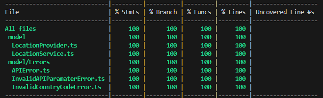
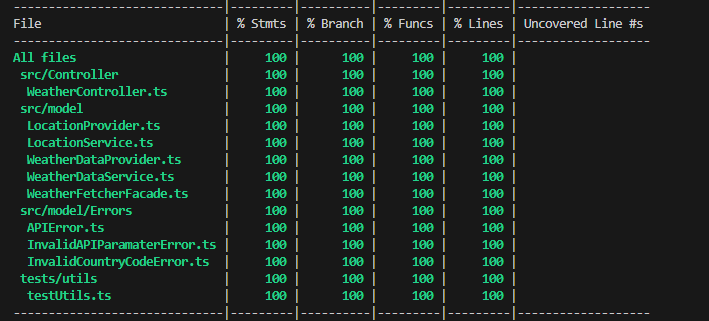
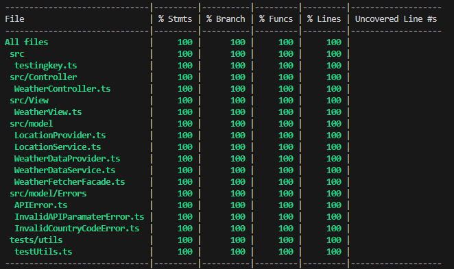

# Coverage

## Coverage Report

This document contains simple coverage output at certain points in the project. The coverage shown is generated everytime the tests are run, and will therefore not be a complete report.

The coverages shown will be taken after a commit has been pushed and consequently the coverage report will include the commit hash in the title.

### Coverage Report - ee502ca

Taken on Date 2023-11-15: 09:51

### Coverage Reprot - 0ba2938

Taken on Date 2023-11-30: 01:36

### Coverage Report - fe5f2a6

Taken on Date 2023-11-30: 20:29
